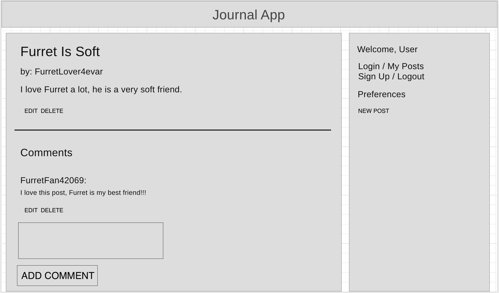
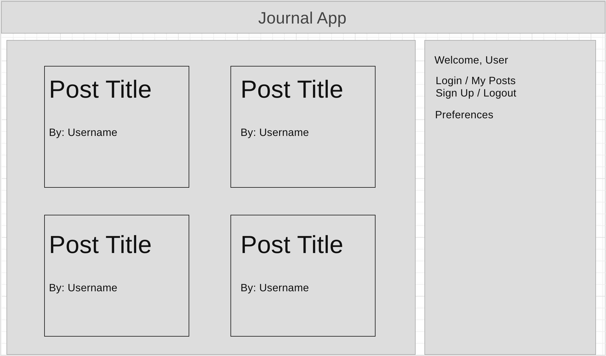
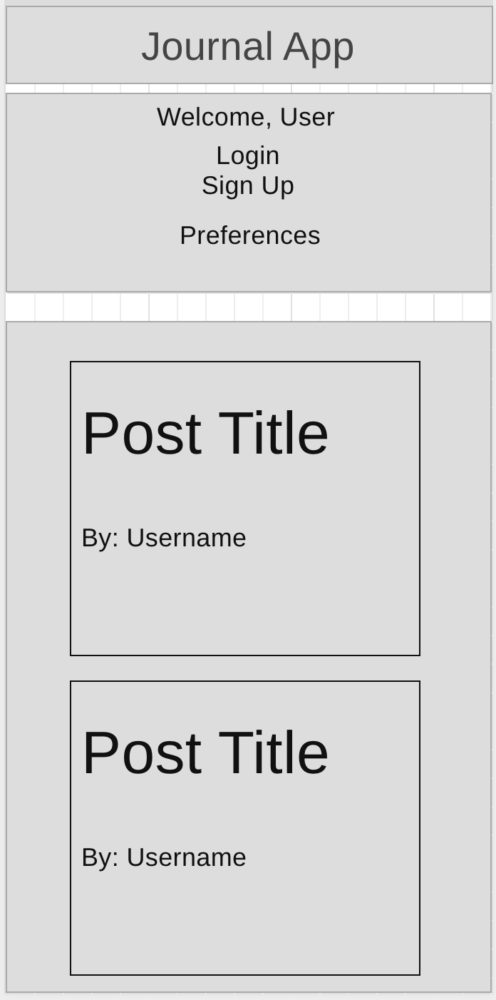
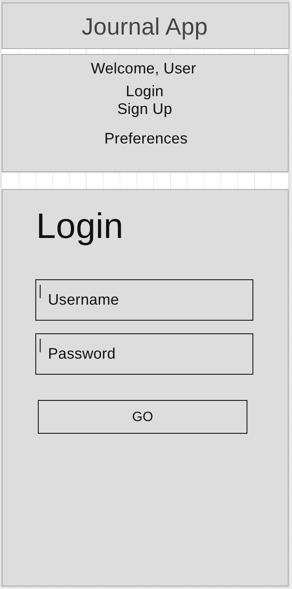
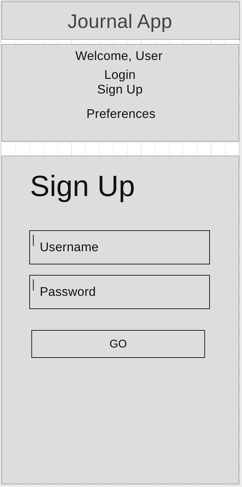
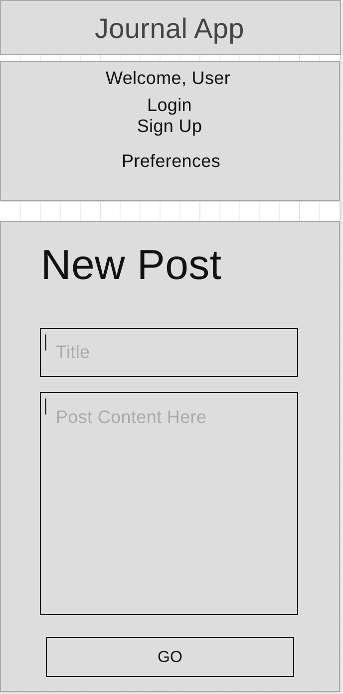
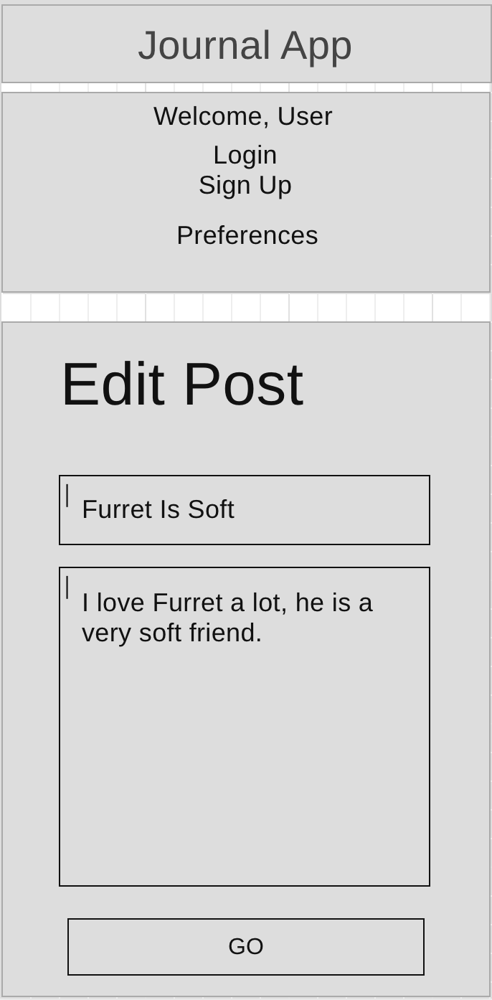
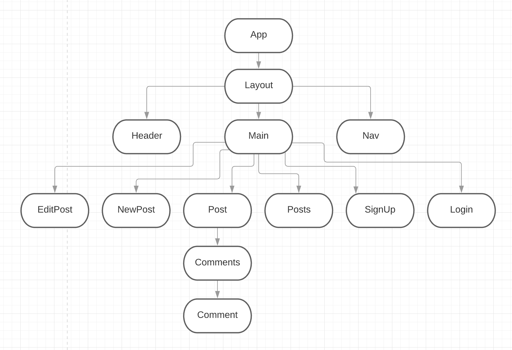
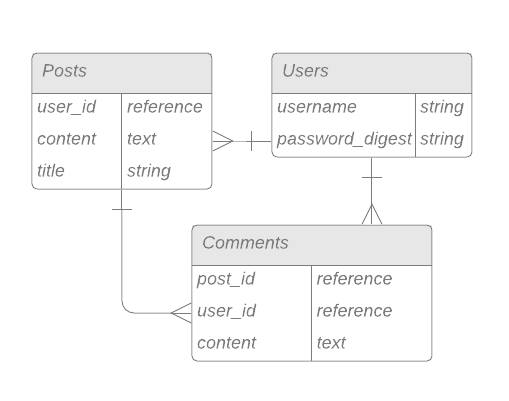

# Journal App README <!-- omit in toc -->

- [Overview](#overview)
- [MVP](#mvp)
  - [Goals](#goals)
  - [Libraries](#libraries)
  - [Client (Front End)](#client-front-end)
    - [Wireframes](#wireframes)
    - [Component Tree](#component-tree)
    - [Component Hierarchy](#component-hierarchy)
    - [Component Breakdown](#component-breakdown)
    - [Component Estimates](#component-estimates)
  - [Server (Back End)](#server-back-end)
    - [ERD Model](#erd-model)
- [Post-MVP](#post-mvp)
- [Code Showcase](#code-showcase)
- [Code Issues & Resolutions](#code-issues--resolutions)

<br>

## Overview

**Journal App** is essentially a blog app, build from scratch. The intention is to make it so eventually, it can be used to publish, search, tag, archive, read, and share any entries. It utilizes a ruby on rails backend and a react frontend.


<br>

## MVP

The **Journal App** MVP will include the following:

- Have a **RESTful JSON API**.
  - Build a **Ruby on Rails** server, exposing RESTful JSON endpoints.
  - Build a database with at least 3 tables:
    - 1 user table
    - 2 other tables, of your choosing
    - There must be at least 1 association between your tables. (1:m _or_ m:m)
  - Utilize **Rails** to define models for interacting with the database.
  - Implement Authentication using **JWT**.
  - Implement working generic controller actions for full-CRUD (`index`, `show`, `create`, `update`, `delete`) between the 2 non-user tables AND partial-CRUD (`create`, at least) for the user table.
- Have a working, interactive **React** app, built using `npx create-react-app`.
  - Have at least 8 separate, rendered components in an organized and understandable React file structure.
  - Utilize functional and class React components appropriately.
  - Utilize state and props in your components efficiently.
  - Use _only_ React for DOM Manipulation.
- Consume data from your **Ruby on Rails API**, and render that data in your components.
- Utilize **React Router**, for client-side routing.
- Utilize Authentication, permitting the user to:
  - Register, login, and send authenticated requests.
  - Perform `index` or `show` actions, **whether or not they are logged in** for Posts.
  - Perform `create`, `update`, and `delete` actions **when logged in** for Posts.
  - Perform `create` action **when logged in** for Comments.
- Use flexbox or Grid in your layout design.
- Implement 2 media queries for responsive design on 3 screen sizes (including desktop).

<br>

### Goals

- Create a journal app with posting and commenting functionality
- Make sure it's presentable and readable on multiple screen sizes

<br>

### Libraries

|     Library      | Description                                |
| :--------------: | :----------------------------------------- |
|      React       | _Frontend App_ |
|       SCSS       | _Styling_ |
|   React Router   | _Frontend Routing_ |
|      Axios       | _Connect frontend to backend_ |
|  Ruby on Rails   | _Backend server_ |
|       JWT        | _Authentication_ |
|      Bcrypt      | _Password security_ |
|    PostgreSQL    | _Database_ |

<br>

### Client (Front End)

#### Wireframes

Expand to view.
<details>



- Desktop Post



- Desktop Posts


- Tablet Posts



- Mobile Posts



- Mobile Login



- Mobile Sign Up



- Mobile New Post



- Mobile Edit Post

</details>

**Notes**
- *All content layout is the same across mobile and desktop aside from the nav bar and the posts view*
- *Logged in users see different nav bar choices, they are described in the desktop views, but omitted in the tablet/mobile views for brevity, though of course in the final they will be included properly*
- *Edit and delete comments will be Post-MVP*

#### Component Tree

Expand to view.
<details>



</details>

#### Component Hierarchy

``` structure

src
|__ assets/
      |__ fonts
      |__ graphics
      |__ images
      |__ mockups
|__ components/
      |__ shared/
            |__ Header.jsx
            |__ Nav.jsx
            |__ Main.jsx
            |__ Layout.jsx
      |__ Login.jsx
      |__ SignUp.jsx
      |__ NewPost.jsx
      |__ EditPost.jsx
      |__ Posts.jsx
      |__ Post.jsx
      |__ Comments.jsx
      |__ Comment.jsx
|__ services/

```

#### Component Breakdown

|  Component   |    Type    | state | props | Description                                                      |
| :----------: | :--------: | :---: | :---: | :--------------------------------------------------------------- |
|App| class |   y   |   y   | _App root_               |
|Header| functional |   n   |   n   | _Holds the site name_               |
|Nav| functional |   n   |   y   | _Nav top or side bar (depending on screen size)_       |
|Main|functional|   n   |   y   | _Box for the main content to live in_      |
|Layout| functional |   n   |   y   | _Holds the header, nav, and main components, as well as layout children._                 |
|Login| functional |   n   |   y   | _Login as an existing user._ |
|SignUp| functional |   n   |   y   | _Create a new user._ |
|NewPost| functional |   n   |   y   | _Create a new post._ |
|EditPost| functional |   n   |   y   | _Lets you edit a given post._ |
|Posts| functional |   n   |   y   | _Shows a list of all posts._ |
|Post| class |   y   |   n   | _Shows a post's details, as well as its comments._ |
|Comments| functional |   n   |   y   | _Shows multiple `Comment` components and lets you add a comment._ |
|Comment| functional |   n   |   n   | _Shows an individual comment._ |

#### Component Estimates

| Task                | Priority | Estimated Time | Time Invested | Actual Time |
| ------------------- | :------: | :------------: | :-----------: | :---------: |
| Database models     |    H     |     2 hrs      |     40m     |     TBD     |
| Controllers (CRUD)  |    H     |     5 hrs      |     1h 35m     |     TBD     |
| Routing (backend)   |    H     |     3 hrs      |     20m     |     TBD     |
| Seed data           |    M     |     1.5 hrs    |     35m     |     TBD     |
| Authentication      |    H     |     5 hrs      |     45m     |     TBD     |
| Connect rails/react |    H     |     4 hrs      |     1h 10m     |     TBD     |
| Component creation  |    H     |     3 hrs      |     2h 12m     |     TBD     |
| State and methods   |    H     |     3 hrs      |     2h 52m     |     TBD     |
| React router        |    M     |     1.5 hrs    |     1h 17m     |     TBD     |
| Basic CSS           |    L     |     1.5 hrs    |     20m     |     TBD     |
| Mobile layout       |    M     |     1 hrs      |     50m     |     TBD     |
| Tablet layout       |    M     |     1 hrs      |     _ hrs     |     TBD     |
| Desktop layout      |    M     |     1 hrs      |     _ hrs     |     TBD     |
| Code cleanup        |    M     |     0.5 hrs    |     1m     |     TBD     |
| TROUBLESHOOTING     |    H     |     7 hrs      |     1h 32m     |     TBD     |
| TOTAL               |          |     40 hrs     |     _ hrs     |     TBD     |

<br>

### Server (Back End)

#### ERD Model

Expand to view.
<details>



</details>

<br>

***

## Post-MVP

- Implement rich text editor
- Dark/light theme toggle and preference (saved to user account and/or local storage)
- Tagging and search system
- Add image(s) to posts
- Edit/delete comments
- View only a given user's posts

***

## Code Showcase

> Use this section to include a brief code snippet of functionality that you are proud of and a brief description.

## Code Issues & Resolutions

> Use this section to list of all major issues encountered and their resolution, if you'd like.